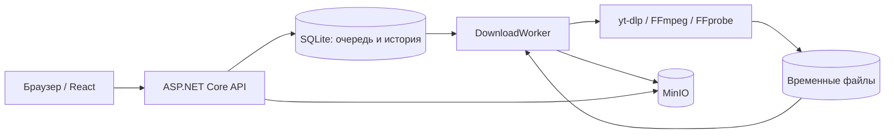
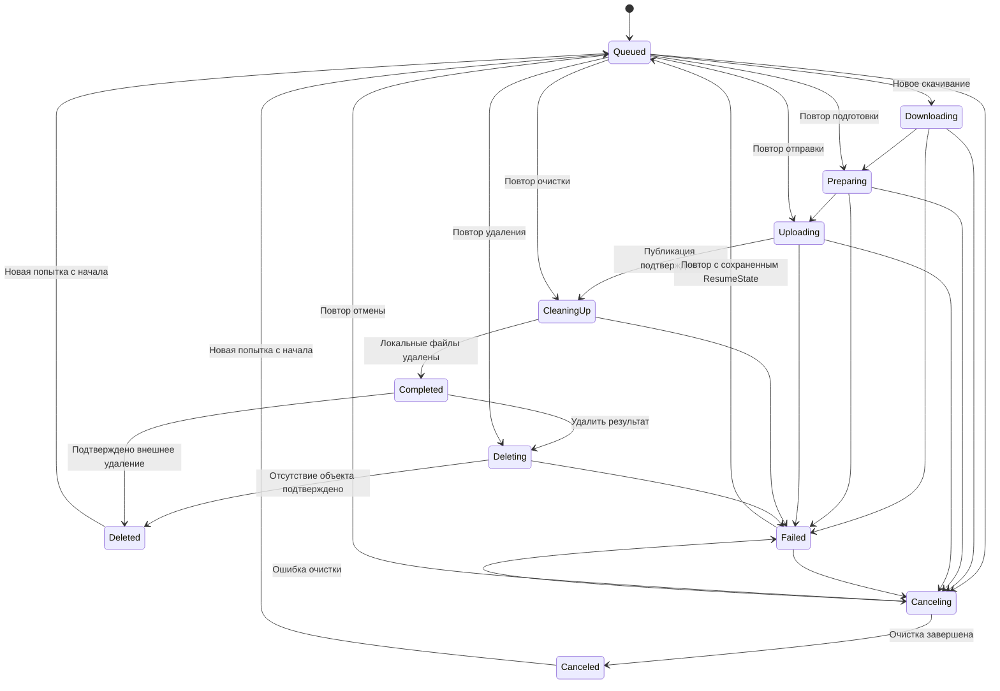

# Технический проект MVP yt-dlp WebUI

Статус: создан каркас ASP.NET Core/React и интерфейс библиотеки с моковым API по указанию пользователя. Моковые данные и JWT-сессии хранятся в памяти; постоянное хранение, фоновые загрузки и медиапроцессы описывают следующие этапы реализации. Дата: 2026-10-01. Фактические команды и ограничения приведены в [readme.md](readme.md).

Функциональные требования находятся в [MVP-SPEC.md](MVP-SPEC.md). Здесь описаны предлагаемые технические решения, границы компонентов и проверки. Конкретные версии зависимостей фиксируются при создании каркаса после проверки совместимости.

2026-10-02: реализована первая итерация настоящего бэкенда — агрегат `Download` с внутренним автоматом состояний. Агрегат хранит текущую попытку, публикацию, состояние, точку продолжения, намерение отмены и ошибку. `Download.Create` создает ожидающее задание, `Download.Restore` восстанавливает его из сохраненного `DownloadSnapshot`. Публичные свойства агрегата доступны только для чтения. `Download.Apply` принимает событие, проверяет его через внутренний `DownloadStateMachine` и изменяет состояние только при разрешенном переходе; результат содержит снимок и `DownloadIntent` либо причину отказа. Событие `StageFailed` охватывает в том числе ошибку Canceling. Подтверждения внешних действий передает вызывающий сервис; агрегат сам не проверяет файлы или S3. `AllowedActions` вычисляет повтор/отмену для карточки задания, а `CanDeleteResult` — возможность удаления через библиотеку.

Во второй итерации реализованы EF Core SQLite и миграция `InitialPersistence`: `AppDbContext`, сущности с суффиксом `Record` в `Infrastructure/Persistence/Entities/` и миграции в `Migrations/`. Конфигурации сущностей находятся в `AppDbContext.OnModelCreating`, настройка options — непосредственно в DI-регистрации `AddAppDatabase`, включение WAL и применение миграций — в `AppDbContext.InitializeAsync`. Регистрация вызывается в `Program.cs` с конфигурацией хоста; `dotnet-ef` получает контекст из его DI без отдельной factory. Конвертер дат и interceptor соединения используют общие неизменяемые экземпляры `Instance`. `DownloadRecord` сохраняет снимок агрегата и `DownloadIntent`, версия автоматически увеличивается при изменении записи. Схема хранит историю попыток, этапы, артефакты, отправки и сессии, обеспечивает ограничения уникальности и принадлежности результатов одному заданию. Реальные файловые SQLite-тесты проверяют восстановление данных, миграции, конкурентные записи и атомарный откат состояния вместе с историей. При замене активной попытки ее завершение сохраняется перед вставкой новой в общей транзакции: это учитывает немедленную проверку уникального индекса SQLite. Инициализация БД в хосте пока не подключена, HTTP API и сессии остаются моковыми. Их подключение и сервисы выполнения относятся к следующим итерациям.

## 1. Архитектура приложения

Один ASP.NET Core Web-проект, один процесс приложения, один экземпляр контейнера. В процессе работают HTTP API и последовательный фоновый обработчик. React собирается в статические файлы, которые раздает Kestrel с того же origin.



Для MVP не вводятся отдельные проекты слоев, брокер сообщений, Hangfire или универсальный repository поверх EF Core. Разделение ответственности обеспечивается каталогами и небольшими сервисами внутри одного проекта.

Два контейнера приложения с общей SQLite и временной папкой не являются поддерживаемым режимом MVP. Обновление контейнера выполняется с остановкой предыдущего экземпляра.

## 2. Структура кода

```text
src/Ytdlp.Ui/
├── Program.cs
├── Features/
│   ├── Auth/          # AuthEndpoints, DTO, проверка учетных данных
│   ├── Downloads/     # DownloadEndpoints, DTO, сервис команд
│   └── Library/       # LibraryEndpoints, DTO, каталог и отдача файлов
├── Domain/
│   ├── Download.cs    # Агрегат задания
│   ├── DownloadStateMachine.cs # Правила переходов
│   ├── Events/        # События жизненного цикла
│   ├── ValueObjects/  # Ошибка, снимок и результат перехода
│   └── Primitives/    # Состояния, действия и коды отказов
├── Processing/        # DownloadWorker, этапы, отмена, восстановление
├── Infrastructure/
│   ├── Persistence/   # DbContext с конфигурациями EF, сущности, миграции
│   ├── Media/         # Запуск yt-dlp, FFmpeg, FFprobe
│   ├── Storage/       # AWSSDK.S3 и локальное рабочее хранилище
│   └── Authentication/
└── Configuration/     # Типизированные Options и их валидация

src/Ytdlp.Ui.Client/
├── package.json
├── package-lock.json
├── dist/              # Результат сборки, не коммитится
└── src/
    ├── api/
    ├── components/
    ├── features/auth/
    ├── features/downloads/
    ├── features/library/
    ├── locales/en/
    ├── locales/ru/
    └── styles/
```

Согласован ASP.NET Core Minimal API. Регистрация endpoints вынесена в `AuthEndpoints`, `DownloadEndpoints` и `LibraryEndpoints` в соответствующих каталогах `Features/`. В `Program.cs` остаются настройка приложения и вызовы методов регистрации групп маршрутов.

Маршруты группируются через `MapGroup`: `/api/auth`, `/api/downloads` и `/api/library`. Вся группа заданий требует авторизации администратора; в библиотеке чтение публичное, а удаление защищено отдельно. В группе авторизации login и проверка сессии доступны публично согласно контракту API, logout требует действующей сессии.

Обработчики отвечают за привязку и валидацию входных DTO, вызов сервисов через DI и преобразование результата в HTTP-ответ. Ошибки валидации возвращаются в согласованном формате `ProblemDetails` с кодом `400`. Правила конечного автомата, обработка очереди и запуск внешних процессов остаются в соответствующих сервисах. Маршруты и контракты описаны в разделе 7.

Основные границы:

| Компонент | Ответственность |
| --- | --- |
| `DownloadService` | Создание задания, повтор, запрос отмены, чтение истории |
| `Download` | Агрегат задания: хранение текущего состояния, применение событий и доступные действия |
| `DownloadStateMachine` | Внутренние правила агрегата: разрешенные события, условия переходов и вычисление следующего состояния без внешнего ввода-вывода |
| `DownloadWorker` | Выбор следующей попытки, последовательное выполнение этапов |
| `DownloadRecoveryService` | Согласование БД и рабочих файлов при запуске |
| `YtDlpClient` | Метаданные, скачивание выбранных дорожек, события прогресса |
| `MediaPreparationService` | Проверка и объединение дорожек без перекодирования |
| `ObjectStorage` | Каталог, чтение, удаление, отправка и проверка объекта S3 |
| `WorkspaceStorage` | Изолированные папки задания, проверка и очистка файлов |

Интерфейсы нужны прежде всего на границах процессов, хранилища и времени. `DbContext` используется напрямую с коротким временем жизни. Фоновый обработчик создает scope для отдельной операции, не удерживая контекст и транзакцию на время скачивания. Это соответствует модели [hosted services и scoped dependencies](https://learn.microsoft.com/en-us/aspnet/core/fundamentals/host/hosted-services?view=aspnetcore-10.0).

## 3. Модель данных

Разделяем логическую загрузку, попытки ее выполнения и результаты этапов.

| Сущность | Основные данные |
| --- | --- |
| `Download` | `Id`, исходный URL, ключ сравнения URL, название, состояние автомата, текущая попытка, `FailedState`, `ResumeState`, запрос отмены, состояние публикации, даты, версия записи |
| `DownloadAttempt` | `Id`, `DownloadId`, номер, причина запуска (включая удаление результата), начальное состояние обработки, состояние попытки, время постановки/старта/окончания, код и подробности ошибки |
| `StageExecution` | Попытка, этап, состояние, даты, ссылка на использованный результат предыдущей попытки, ошибка |
| `DownloadArtifact` | Загрузка, поколение рабочего каталога, тип дорожки/готового файла, относительный путь, размер, контрольная сумма при необходимости, признак готовности |
| `StorageTransfer` | Загрузка, готовый артефакт, ключ S3, идентификатор публикации, multipart upload ID, состояние отправки, размер/контрольная сумма |
| `AdminSession` | Случайный идентификатор сессии из JWT (`jti`), время выдачи/истечения и отзыва; без хранения самого JWT |

Текущий этап выводится из состояния автомата, а не изменяется независимо от него. `StageExecution` хранит историю выполнения операций `Download`, `Prepare`, `Upload`, `Cleanup`, `DeleteResult` и `CancelCleanup`. `FailedState` сохраняет место отказа, `ResumeState` — состояние обработки, в которое worker должен войти после очереди. Состояние попытки описывает ее исход и не заменяет автомат загрузки. Удаление результата получает отдельную попытку, сохраняя успешную попытку скачивания в истории.

- Идентификаторы — UUID; даты в API — ISO 8601 UTC. Для сортировки в SQLite даты хранятся как целое количество миллисекунд Unix, без зависимости SQL-запросов от операций над `DateTimeOffset`.
- Уникальный индекс на ключ URL защищает от двух одновременных запросов создания. Проверка через отдельный `SELECT` используется только для понятного ответа; окончательная защита — ограничение БД.
- Номер попытки уникален в пределах загрузки. Одновременно может существовать только одна незавершенная попытка загрузки; создание повтора и изменение состояния выполняются транзакционно.
- При повторе сохраняется история предыдущей попытки. Успешные артефакты принадлежат загрузке и доступны следующей попытке.
- Для конкурентных команд используется управляемый приложением счетчик версии записи. Переходы выполняются условным обновлением состояния/версии.
- Прогресс хранится как необязательная величина этапа. Частые обновления объединяются, например до одной записи в секунду; переходы состояния сохраняются сразу.
- Настраиваются foreign keys, WAL и конечный busy timeout. Транзакции не охватывают сетевой ввод-вывод и работу внешних процессов.

Ограничения провайдера SQLite учитываются при проектировании миграций и concurrency tokens; проверка состояния выполняется на настоящей SQLite, а не EF InMemory. См. [ограничения EF Core SQLite](https://learn.microsoft.com/en-us/ef/core/providers/sqlite/limitations).

### Дубликаты URL

Согласовано сравнение по URL, без распознавания ролика по разным ссылкам. Для технической нормализации удаляются внешние пробелы; схема и host приводятся к стандартному виду, стандартный порт убирается. Регистр пути, параметры и их порядок сохраняются. Произвольные query-параметры не отбрасываются, поскольку они могут менять источник.

Исходная строка сохраняется отдельно. Разные ссылки на один ролик не считаются одинаковыми автоматически. Индекс уникальности URL сохраняется и после удаления готового файла: удаление не создает новую логическую загрузку.

Обработка `POST /api/downloads`:

| Результат поиска URL | Поведение |
| --- | --- |
| Задания нет | Создать загрузку и первую попытку, ответить `201` |
| Есть ожидающая, активная или отменяемая попытка | `409 download_already_exists`, вернуть ID существующей загрузки |
| Задание завершено, файл доступен | `409 download_already_exists` |
| Задание в Deleted либо завершено и отсутствие файла подтверждено | Зафиксировать Deleted, создать новую попытку того же задания с этапа Download, ответить `202` с прежним downloadId |
| Задание завершилось ошибкой или отменено | `409 download_already_exists`; предложить явный ручной повтор существующего задания |
| Проверка наличия результата недоступна | `503 storage_unavailable`; не считать файл удаленным |

Отправка старого URL для удаленного результата и кнопка «Повторить» вызывают одну команду `RetryDeletedResult`. Она сохраняет ID/URL и историю задания, создает новый номер попытки и новую публикацию. Проверка S3 выполняется вне транзакции БД; после нее версия записи и возможность перехода проверяются повторно внутри транзакции. Одновременные запросы создают не более одной активной попытки.

## 4. Очередь и состояния

Источник очереди — SQLite. Сигнал в памяти используется лишь для быстрого пробуждения обработчика; потеря сигнала не теряет задание, поскольку обработчик периодически проверяет БД.

Порядок — FIFO по времени постановки попытки и ее ID. Ручной повтор становится в конец очереди. В каждый момент worker выполняет одну попытку, включая подготовку, отправку в S3 и локальную очистку.

Этапы включены непосредственно в автомат: `Queued`, `Downloading`, `Preparing`, `Uploading`, `CleaningUp`, `Completed`, `Deleting`, `Deleted`, а также `Canceling`, `Failed`, `Canceled`. `Downloading`, `Preparing`, `Uploading`, `CleaningUp`, `Deleting` и `Canceling` — состояния выполнения внешней операции. Обобщенное `Running` не хранится как самостоятельное состояние.

`PublicationState` описывает отдельно известный факт о файле: `None`, `Available`, `Deleted` или `Unknown`. Например, при `CleaningUp` и при ошибке очистки файл уже `Available`. Намерение удаления выражается состоянием автомата `Deleting`, а не состоянием доступности. Недоступность S3 не означает `Deleted`.

`DownloadStateMachine` реализуется как явная таблица переходов и guards в доменной модели. Для MVP достаточно собственного небольшого компонента, без обязательного пакета автоматов. Все изменения состояния от API, worker и восстановления проходят через него. Сериализуется состояние и контекст автомата, а не объект с делегатами.

Агрегат `Download` принимает событие и передает текущий снимок внутреннему автомату. При разрешенном переходе агрегат обновляет собственное состояние и возвращает намерение выполнить действие; при отказе остается неизменным. Сервис сохраняет состояние агрегата и намерение в БД, затем worker выполняет внешний эффект и передает агрегату событие результата. В самих переходах нет сетевых запросов, запуска процессов или долгих транзакций. События worker содержат attemptId и этап: устаревшее событие предыдущей попытки не меняет текущую. `DownloadSnapshot` служит для сохранения/восстановления и передачи состояния; изменение копии снимка не меняет агрегат.



`CancelRequested` — сохраняемое намерение; состояние `Canceling` показывает его обработку. `Canceled` выставляется только после остановки обработки и успешной очистки. API возвращает актуальные `allowedActions`, вычисленные по guards автомата и известному состоянию файла; UI не дублирует правила переходов.

| Событие | Условие | Результат |
| --- | --- | --- |
| `StartAttempt` | Queued, попытка еще не занята worker | Сохраненное ResumeState; для новой загрузки — Downloading |
| `StageSucceeded` | Downloading / Preparing / Uploading / CleaningUp, совпадают попытка и состояние | Preparing / Uploading / CleaningUp / Completed соответственно; публикация подтверждается перед CleaningUp |
| `StageFailed` | Любое состояние выполнения операции, совпадают попытка и состояние | Failed с FailedState, ResumeState, артефактами и причиной |
| `RequestCancel` | Downloading / Preparing / Uploading либо Queued / Failed с ResumeState одного из этих трех этапов | Canceling, сохранение намерения, остановка работы и очистка |
| `CancellationSucceeded` | Canceling, очистка подтверждена | Canceled |
| `CancellationFailed` | Canceling, остановка/очистка не завершена | Failed, ResumeState=Canceling и сохраненное намерение отмены |
| `Retry` | Failed / Canceled, нет активной попытки | Queued с новой попыткой и рассчитанным ResumeState; для Canceled — Downloading |
| `RequestDeleteResult` | Completed либо Failed с ResumeState=Deleting, нет активной попытки | Deleting, новая попытка удаления и сохраненное намерение удалить текущую публикацию |
| `ResultDeleted` | Deleting либо Completed при обнаружении внешнего удаления; подтверждено отсутствие объекта | Deleted и PublicationState=Deleted; история успешного скачивания сохраняется |
| `RetryDeletedResult` | Deleted, нет активной попытки | Queued, новая попытка с ResumeState=Downloading и новая публикация |
| `ProcessInterrupted` | Любое состояние выполнения операции после рестарта, но не Queued | Failed с исходным FailedState и ResumeState; продолжение только по ручной команде |

`Completed` достигается только после успешной локальной очистки. Ошибка очистки переводит задание в `Failed` с `ResumeState=CleaningUp`, сохраняя доступность файла в библиотеке. `Deleted` достигается после подтверждения удаления готового результата; успешная попытка скачивания остается в истории. Если отмена прервана, сохраненный запрос отмены ведет к продолжению отмены, а не к скачиванию заново. Схема показывает переходы, а таблица задает их условия; отмена удаления готового результата не предлагается.

Отмена в `CleaningUp` запрещена, включая `Failed` и `Queued` с `ResumeState=CleaningUp`. В `allowedActions` нет отмены; `POST /api/downloads/{id}/cancel` возвращает `409 invalid_state` без изменения состояния и файлов. После ошибки доступен повтор очистки, после Completed — удаление через библиотеку. Повтор ранее принятого запроса отмены остается идемпотентным и не создает новую работу.

Гонка отмены с переходом Uploading → CleaningUp разрешается условным обновлением версии записи. Если первым сохранен CleaningUp, отмена отклоняется. Если первым сохранен Canceling, позднее событие успеха отправки не переводит задание в CleaningUp; обработчик завершает ранее принятую отмену по правилам очистки текущей публикации.

### Повтор

1. Проверить допустимость команды и отсутствие другой активной попытки.
2. Определить ResumeState по проваленному состоянию и сохраненному намерению. Проверить фактический результат операции: она могла завершиться до записи успеха в БД.
3. Для Downloading / Preparing / Uploading проверить только необходимые артефакты. При ошибке отправки не запускать yt-dlp и FFmpeg заново, если готовый файл цел; если публикация уже подтверждена, перейти к CleaningUp без повторной отправки.
4. Если необходимые артефакты утрачены или повреждены, явно записать причину в историю и начать с самого раннего этапа, который нужно восстановить. Это правило не откатывает CleaningUp / Deleting / Canceling к скачиванию: отсутствие удаляемого файла означает, что соответствующая часть очистки уже выполнена.
5. После отмены промежуточных файлов нет, поэтому повтор начинается со скачивания.
6. Для `Deleted` новая попытка начинается с `Downloading`, старые завершенные попытки и публикации сохраняются в истории. Новый `publication-id` не позволяет поздней очистке старой публикации удалить новый результат.
7. Повтор CleaningUp удаляет только оставшиеся локальные файлы. Повтор Deleting проверяет и при необходимости удаляет только прежнюю публикацию в S3. Повтор Canceling завершает остановку и удаление промежуточных результатов. Все три операции допускают частично выполненную очистку.

Переход в состояние операции и ее идентификаторы сохраняются до внешнего действия. После действия сохраняется событие успеха вместе с результатом и следующим состоянием в одной транзакции БД. При сбое между действием и записью результата повтор сначала согласует сохраненное намерение с фактическим состоянием файлов/S3. Это возобновление с этапа, без обещания побайтового продолжения любой операции.

## 5. Скачивание и подготовка медиа

Рабочий каталог: `/data/work/<download-id>/<workspace-generation>/`. Повтор проваленного этапа использует прежнее поколение и его артефакты; новое скачивание после удаления результата получает новое поколение. Очистка обращается к сохраненному поколению и списку артефактов, чтобы запоздалая операция не удалила файлы новой попытки. Внешние названия не используются как локальные пути. Процессы получают аргументы через `ProcessStartInfo.ArgumentList`; shell не используется.

### Этап Download

1. Получить структурированные метаданные одного источника. Это часть этапа `Download`, а не отдельная публичная функция.
2. Проверить, что результат содержит один завершенный ролик, а не playlist, текущий или запланированный эфир. Архив завершенного эфира можно обрабатывать как обычный ролик. URL конкретного ролика с контекстом плейлиста обрабатывается как один ролик; самостоятельный URL плейлиста отклоняется.
3. Выбрать видео до 1080p и аудио, предпочитая MP4 при подходящем исходном формате. При отсутствии подходящего видео с аудио вернуть `format_unavailable`, не повышая разрешение и не перекодируя.
4. Сохранить план форматов. Скачать готовый совмещенный поток либо выбранные дорожки отдельно, чтобы автоматическое объединение yt-dlp не скрывало самостоятельный этап `Prepare`.
5. Для каждой дорожки сохранить проверенный путь и состояние. Готовую дорожку повторно не скачивать; частичную можно продолжить, если это поддерживает источник.

Конкретные CLI-аргументы разделения дорожек проверяются на выбранной версии yt-dlp до основной реализации: отдельно выбранные format ID скачиваются отдельными вызовами без автоматического merge; автоматические fixup отключаются. Если ссылки на сегменты истекли, метаданные обновляются в пределах того же этапа.

Используются JSON/явные шаблоны вывода, а не разбор человекочитаемого текста. Прогресс принимается из `--progress-template`; при неизвестном общем размере процент равен `null`. Для нескольких дорожек процент считается по суммарным байтам только при известных размерах, иначе отображается индикатор без процента. См. [документацию yt-dlp](https://github.com/yt-dlp/yt-dlp#embedding-yt-dlp).

### Этап Prepare

- Для уже готового совмещенного файла проверяется наличие видео и аудио; ненужное объединение пропускается.
- Для раздельных дорожек запускается FFmpeg с копированием потоков. Перекодирование запрещено.
- Контейнер выбирается по совместимости исходных кодеков: MP4 при возможности, иначе подходящий исходный контейнер или MKV. Формат расширения соответствует фактическому файлу.
- Результат сначала записывается во временный файл, проверяется FFprobe и атомарно переименовывается в готовый артефакт в том же каталоге.
- Исходные дорожки сохраняются до подтвержденной отправки в S3, чтобы ошибка объединения не требовала нового скачивания.

Список путей от внешнего процесса проверяется на принадлежность рабочему каталогу задания. stdout и stderr читаются одновременно; отмена останавливает дерево процессов и ожидает их завершения до очистки файлов.

## 6. Отправка в S3 и восстановление

`AWSSDK.S3` настраивается через endpoint, bucket, access key, secret key и region; для MinIO используется адресация path-style (`ForcePathStyle`). См. [AmazonS3Config](https://docs.aws.amazon.com/sdkfornet/v4/apidocs/items/S3/TS3Config.html).

### Ключи и идентификация результата

- Предлагаемый ключ: `downloads/<download-id>/<publication-id>/<safe-title>.<ext>`.
- `publication-id` и ключ создаются до отправки и сохраняются в БД. Повтор отправки использует тот же ключ.
- Название очищается только для имени файла. UUID в пути исключает совпадение ключей у разных заданий с одинаковым названием.
- В metadata объекта сохраняются идентификаторы загрузки/публикации, размер и вычисленная SHA-256 готового файла. Multipart ETag не считается контрольной суммой всего файла.
- Каталог показывает имя файла и сохраняет полный ключ как его идентификатор; вложенность ключа не превращается в навигацию по папкам.

### Upload

Отправка читает файл потоком и поддерживает multipart, чтобы приложение не ограничивалось размером одного запроса загрузки. Размер части выбирается с учетом размера файла и ограничений S3. Одновременно отправляется одна часть; весь файл в память не читается.

`StorageTransfer` сохраняет известный `uploadId`. Ручной повтор этапа может заново отправить файл целиком, не скачивая источник; продолжение отдельных частей не является требованием MVP. Перед новым multipart-сеансом удаляются незавершенные части предыдущего сеанса этого задания. Не выполняется очистка чужих загрузок bucket.

После ответа `CompleteMultipartUpload` проверяется объект по ключу и ожидаемым metadata/размеру. Только затем результат отмечается опубликованным. При неизвестном исходе запроса сначала выполняется проверка объекта, а не повторная публикация вслепую. Multipart-процесс основан на [операциях S3](https://docs.aws.amazon.com/AmazonS3/latest/userguide/mpuoverview.html); совместимость проверяется на MinIO.

Окно между созданием multipart-сеанса и сохранением `uploadId` закрывается поиском незавершенных отправок строго по уникальному ключу текущей публикации. Неизвестный объект с тем же ключом не перезаписывается: возвращается конфликт.

### После рестарта

1. Применить миграции, проверить доступность локальных volumes и запустить восстановление до обработки очереди.
2. Прерванные активные попытки пометить `Failed` с кодом `interrupted`, сохранив FailedState и ResumeState; это относится также к CleaningUp, Deleting и Canceling. Автоматически их не возобновлять.
3. Сохранить ожидающие попытки и промежуточные файлы. Сохраненные запросы отмены и удаления определяют точку ручного повтора; их незавершенные результаты нельзя использовать для нового скачивания.
4. При ручном повторе `Upload` сначала проверить, не был ли объект уже успешно создан до сбоя. Если он соответствует публикации, зафиксировать успех и перейти к очистке.
5. При повторе CleaningUp, Deleting или Canceling проверить, какая часть удаления уже выполнена, и продолжить оставшуюся. Отсутствующие входные артефакты Download / Prepare / Upload отметить недействительными; восстановить необходимый этап только после команды повтора.

### Очистка и отмена

Очистка после успешной публикации — обязательное состояние `CleaningUp` в автомате. Ошибка дает `Failed`, код `cleanup_failed` и `ResumeState=CleaningUp`; стандартная кнопка «Повторить» создает попытку только очистки. Файл остается доступен в S3. После подтвержденного удаления всех локальных артефактов автомат переходит в `Completed`. Если файлы удалены до сбоя записи в БД, повтор подтверждает их отсутствие и завершает этап без скачивания или отправки заново.

При отмене worker останавливает процесс/отправку, дожидается завершения ввода-вывода, прерывает multipart-сеанс и удаляет локальные артефакты. Если отправка успела завершиться до фиксации отмены, удаляется только объект с идентификатором текущей незавершенной публикации. При несовпадении metadata чужой объект не удаляется.

Если очистка не удалась, загрузка не изображается успешно отмененной: сохраняются причина и возможность повторить очистку. Для уже завершенного задания удаление готового объекта выполняется через библиотеку. Удаление собственного объекта, пока задание не дошло до Completed (включая CleaningUp или ошибку очистки), возвращает `409`, чтобы не конфликтовать с обработкой. При обнаружении внешнего удаления во время очистки сначала завершается локальная очистка; затем автомат фиксирует Completed → Deleted без запуска скачивания.

## 7. API

Маршруты бизнес-API начинаются с `/api`; служебные проверки состояния располагаются под `/health`. JSON использует camelCase; состояния передаются стабильными строковыми кодами. Неизвестный API-маршрут возвращает `404`, а не HTML приложения.

| Метод и маршрут | Доступ | Назначение и результат |
| --- | --- | --- |
| `GET /api/auth/session` | Публичный | `200`, признак входа; без учетных данных и внутренней конфигурации |
| `POST /api/auth/login` | Публичный | `{ username, password }`; `200` с `{ accessToken, tokenType: "Bearer", expiresAt }` либо `401` |
| `POST /api/auth/logout` | Администратор, Bearer JWT | Отозвать текущую JWT-сессию; `204`, после чего клиент удаляет токен |
| `GET /api/library` | Публичный | Все файлы: ID, название, размер, lastModified, URL скачивания |
| `GET /api/library/{fileId}/content` | Публичный | Поток файла с заголовком attachment |
| `DELETE /api/library/{fileId}` | Администратор, Bearer JWT | Удалить объект; `204`, включая уже отсутствующий объект |
| `GET /api/downloads` | Администратор | Список заданий с текущей попыткой, прогрессом и allowedActions |
| `GET /api/downloads/{id}` | Администратор | Задание и история попыток/этапов |
| `POST /api/downloads` | Администратор, Bearer JWT | `{ url }`; `201` для новой загрузки или `202` для повтора старой после удаления результата; ID задания/попытки и Location |
| `POST /api/downloads/{id}/retry` | Администратор, Bearer JWT | `202`, новая попытка либо `409` при недопустимом состоянии |
| `POST /api/downloads/{id}/cancel` | Администратор, Bearer JWT | `202`, сохраненный запрос отмены; повтор запроса не создает новую работу |
| `GET /health/live` | Публичный | Жив ли процесс, без внутренних подробностей |
| `GET /health/ready` | Публичный | Готовность локального состояния и подключения к bucket; `200` или `503` |

Ответ задания содержит `state`, `failedState`, `resumeState`, `publicationState` и историю этапов. `state` непосредственно обозначает этап выполнения; в Queued и Failed точка продолжения видна из `resumeState`. Команда retry возобновляет также очистку, отмену и удаление результата через ту же сохраняемую очередь. Из Deleted она начинает новое скачивание. Доступные действия возвращаются сервером в `allowedActions`.

Форма создания не передает формат, параметры yt-dlp или имя bucket. Синтаксис URL проверяется до постановки в очередь: абсолютный HTTP(S), без встроенных учетных данных. Проверка типа контента и поддержки источника происходит в worker; отказ фиксируется в истории с кодом ошибки.

`fileId` — обратимое URL-safe представление полного S3-ключа, например Base64url UTF-8. Это не секрет и не ID из БД. Декодирование не превращает ключ в локальный путь; bucket всегда берется из конфигурации. Объекты с пробелами, кириллицей, `/`, `+`, `%` и `#` должны адресоваться без потери символов.

Ошибки API возвращаются в формате Problem Details с `code`, `traceId` и ошибками полей. Основные ответы: `400` — неверный ввод, `401` — нет действительного токена, `403` — нет прав, `404` — объект отсутствует, `409` — дубликат или конфликт состояния, `503` — хранилище временно недоступно. UI локализует ошибки по `code`.

## 8. Каталог и отдача файла

- Состав библиотеки читается из S3, включая все страницы listing и файлы вне приложения. БД используется только для связи с собственными заданиями и защиты от конфликтующих административных действий.
- Список возвращается целиком. Предлагаемая стабильная сортировка — lastModified по убыванию, затем ключ; поиска и пользовательской пагинации нет.
- Файл передается непосредственно из потока ответа S3 в HTTP response. Ответ S3 освобождается после окончания передачи, при отключении браузера запрос отменяется.
- Задаются безопасный `Content-Disposition: attachment` с исходным именем, `Content-Length`, корректный Content-Type и `X-Content-Type-Options: nosniff`.
- В MVP обычный GET возвращает полный файл. Range-запросы можно игнорировать с корректным `200`; поддержка HTTP-докачки не заявляется без отдельной реализации и проверки `206/416`.
- При исчезновении объекта до начала передачи возвращается `404`; при ошибке после начала потока соединение завершается, а не дописывается JSON в тело файла.
- Удаление внешнего файла не требует наличия записи в SQLite. Для собственного файла история задания сохраняется.

Удаление собственного результата сначала создает попытку удаления и фиксирует состояние автомата `Deleting` с ключом текущей публикации, затем удаляет объект в S3 и подтверждает `Deleted`. Первичный DELETE выполняет эту операцию в запросе и возвращает `204` только после успеха. В этот промежуток повторное создание/повтор возвращает конфликт; worker не запускает новую публикацию параллельно удалению старой. При ошибке или рестарте задание получает `Failed` с `ResumeState=Deleting`; ручной retry выполняет удаление через очередь. Повторный DELETE после такого сбоя использует те же правила автомата, создавая попытку удаления, и также исключает параллельную операцию. Удаление уже отсутствующего объекта идемпотентно. Внешние операции не объединяются с БД фиктивной общей транзакцией.

Если объект удален вне приложения, отсутствие обнаруживается при проверке результата. Перед отказом из-за дубликата завершенного задания и перед его повтором бэкенд проверяет известный ключ в S3. Подтвержденный `404/NoSuchKey` для существующего bucket разрешает переход `ResultDeleted`; `403`, отсутствие bucket, timeout и сетевые ошибки — нет. Результат с измененными metadata под тем же ключом дает конфликт, а не разрешение на перезапись. Публичные GET библиотеки и содержимого не ставят задания в очередь: повтор доступен только через административные команды.

## 9. Авторизация

Согласована аутентификация через JWT. Приложение проверяет настроенные учетные данные единственного администратора и выдает подписанный JWT для собственного API. Это локальный механизм закрытого приложения, а не реализация общего OAuth/OIDC-сервера; отдельная регистрация и внешний провайдер для MVP не добавляются.

### Передача JWT

Согласован заголовок `Authorization: Bearer <token>`. Login возвращает JWT в JSON; клиентский API-модуль явно добавляет его к административным запросам и проверке текущей сессии. Токен передается только собственному API приложения, не добавляется в ссылки скачивания и не отправляется на сторонние адреса.

Проверка выполняется стандартным обработчиком `Microsoft.AspNetCore.Authentication.JwtBearer`, читающим Authorization. Cookie и query-параметры не используются как альтернативные источники токена. Предусматривается строгая проверка подписи, разрешенного алгоритма, `iss`, `aud`, `exp`, `sub`, `jti` и роли администратора. Сам JWT не содержит пароль или секреты S3.

Административные полномочия не передаются браузером автоматически: запрос без действительного Bearer JWT не авторизован. Cookie-аутентификация, antiforgery endpoint и CSRF-токены из прежнего проекта удаляются. API принимает JSON для форм; доступ из другого origin не включается без отдельной необходимости. Заголовок Authorization и ответы login не логируются; ответы авторизации имеют `Cache-Control: no-store`.

### Хранение токена на клиенте

Согласовано `sessionStorage`: JWT и срок его действия сохраняются после login и доступны API-модулю после перезагрузки страницы в пределах сессии вкладки. При запуске клиент читает токен и проверяет вход через `GET /api/auth/session` с заголовком Authorization; до подтверждения не показывает административные данные. Пароль не сохраняется. `localStorage` не используется.

`sessionStorage` не является общей сессией всех вкладок браузера; автоматическая синхронизация токенов между вкладками не предусматривается. Восстановление сессии браузером может восстанавливать и состояние вкладки, поэтому гарантированный отзыв обеспечивают явный logout и срок JWT. Наличие токена в хранилище не заменяет серверную проверку его срока и активности. См. [семантику sessionStorage](https://developer.mozilla.org/en-US/docs/Web/API/Window/sessionStorage).

### Выдача, проверка и выход

1. Проверить учетные данные, создать запись `AdminSession` со случайным ID и конечным сроком действия.
2. Подписать JWT стандартной библиотекой. Предлагается HS256 с отдельным случайным ключом не менее 256 бит, issuer/audience из конфигурации; ключ не выводится в логи и не генерируется заново при каждом запуске.
3. Вернуть JWT и срок действия в JSON; клиент сохраняет их в `sessionStorage`. Предлагаемый технический default срока токена — 12 часов без автоматического продления; refresh token в MVP отсутствует.
4. Для административного запроса после криптографической проверки токена проверить, что запись сессии существует, не отозвана и не истекла. API отвечает `401/403`, без HTML redirect.
5. Logout получает текущий Bearer JWT и фиксирует отзыв сессии в БД. После успешного ответа клиент удаляет токен из памяти и `sessionStorage`. Ранее выданный JWT этой сессии больше не принимается. Остальные сессии администратора не отзываются.
6. UI очищает административные данные и прекращает polling. Выход и истечение токена не отменяют фоновые задания. Истекшие записи сессий можно удалять после истечения JWT.

Такая схема использует JWT, но не является полностью stateless: запись сессии нужна для немедленного отзыва. Если БД недоступна, административный запрос не выполняется; ошибка logout не должна сообщаться как подтвержденный сервером отзыв.

См. [проверку JWT в ASP.NET Core](https://learn.microsoft.com/en-us/aspnet/core/security/authentication/configure-jwt-bearer-authentication?view=aspnetcore-10.0). Выбор локальной выдачи, клиентского хранения и отзыва выше — решение этого проекта; ссылка описывает механизм проверки токена и HTTP-ответы.

Production-развертывание предполагает HTTPS, обычно на существующем reverse proxy перед Kestrel. Forwarded Headers принимаются только от настроенного доверенного proxy. Разработка может использовать отдельную локальную HTTP-конфигурацию.

## 10. React UI

Предлагаемый набор: React, TypeScript, Vite, i18next/react-i18next и обычный `fetch`. Одна страница не требует router или глобального state manager. Дизайн строится на CSS tokens и небольших компонентах; конкретная компонентная библиотека пока не фиксируется, чтобы не подменить Material 3 Expressive другим стилем.

Компоненты: `LibraryPage`, `AppHeader`, `LoginDialog`, `DownloadSection`, `DownloadCard`, `CreateDownloadDialog`, `LibraryList`, `FileCard`, `ProgressIndicator`, сообщения ошибок и пустых состояний.

- Начальная загрузка запрашивает каталог и состояние входа. Данные заданий запрашиваются только после подтверждения авторизации.
- API-модуль добавляет `Authorization: Bearer <token>` для административных запросов и проверки сессии. При `401` текущей сессии удаляет токен из памяти и `sessionStorage`, очищает закрытые данные и предлагает новый вход. Поздний ответ запроса с предыдущим токеном не должен сбрасывать новый вход.
- Предлагаемый polling заданий — раз в две секунды при активной работе и реже в простое. Запросы не перекрываются; скрытая вкладка приостанавливает polling и обновляется при возврате.
- После logout/401 текущие запросы отменяются, административное состояние очищается. Поздний ответ старого запроса не должен вернуть закрытые данные на экран.
- Каталог обновляется после публикации/удаления и при возвращении на вкладку. Изменения, сделанные вне приложения, видны при следующем обновлении каталога.
- На телефоне — одна колонка; на широком экране карточки могут располагаться сеткой. Длинные URL и имена не расширяют viewport.
- Системная тема определяется `prefers-color-scheme`, изменения применяются без перезагрузки. Анимации учитывают `prefers-reduced-motion`.
- Язык выбирается по `navigator.languages`: первый поддерживаемый en/ru с учетом регионального варианта, иначе en. Все подписи и коды ошибок локализуются ресурсами.
- Формы имеют подписи, управление клавиатурой и возврат фокуса после закрытия; ошибки не обозначаются только цветом.

Сборка статических файлов опирается на [Vite production build](https://vite.dev/guide/build). Визуальный ориентир остается заданным в ТЗ: [Material 3](https://m3.material.io/).

## 11. Конфигурация и эксплуатация

| Раздел | Параметры |
| --- | --- |
| `Admin` | Username, Password |
| `Jwt` | Issuer, Audience, SigningKey, TokenLifetime |
| `Storage` | Endpoint, Bucket, Region, AccessKey, SecretKey, ForcePathStyle |
| `ConnectionStrings` | AppDatabase: строка SQLite с абсолютным путем, по умолчанию `Data Source=/data/db/app.db` |
| `Paths` | WorkDirectory |
| `MediaTools` | Пути yt-dlp, FFmpeg, FFprobe и JS runtime |
| `ReverseProxy` | Доверенные адреса proxy и обработка Forwarded Headers |

Options проверяются при запуске. Пустые обязательные параметры дают понятную ошибку конфигурации. Bucket и его публичная политика управляются вне приложения; приложение их не создает и не изменяет автоматически.

Приложению нужны операции listing/read/write/delete и управление своими multipart uploads. Даже при публичном чтении для серверных запросов можно использовать настроенные учетные данные, не полагаясь на разрешение анонимного listing.

Постоянные пути: `/data/db/app.db`, `/data/work`. Подпись JWT использует стабильный секрет `Jwt:SigningKey` из конфигурации; отдельный volume Data Protection для выбранной схемы авторизации не требуется. Владелец volumes должен соответствовать непривилегированному пользователю контейнера. Закрытие приложения останавливает процессы и сохраняет прерывание; оно не удаляет файлы как пользовательская отмена.

Логи идут в stdout/stderr с `downloadId`, `attemptId` и этапом. Не логируются пароли, токены, S3 secret, подписанные ссылки и полный сырой вывод метаданных. В БД сохраняется ограниченный диагностический текст ошибки. Это эксплуатационные логи, а не отложенная продуктовая телеметрия.

## 12. Сборка, Docker и CI

### Локальная сборка

- `global.json`, CPM и иерархия props сохраняются по ТЗ. Обработку фронтенда подключает только Web-проект.
- Основной сценарий: `npm ci` и `npm run build` в `src/Ytdlp.Ui.Client/`, затем отдельные `dotnet build` и `dotnet publish`. Vite создает `dist/` рядом с исходниками фронтенда. MSBuild включает готовые файлы как content с путями `wwwroot/` в результат сборки и публикации, без копирования в исходники бэкенда.
- Флаг `-p:BuildFrontend=true` явно включает совместную сборку. Target `BuildFrontend` можно вызвать отдельно; он выполняет `npm ci` при отсутствии или изменении зависимостей и запускает React build. По умолчанию .NET не запускает npm и допускает сборку API без UI; publish без готового `dist/index.html` завершается понятной ошибкой. `--no-build` никогда не компилирует React.
- Реализация targets должна работать из чистого checkout и при `dotnet publish --no-build` после успешного build; статические файлы не должны зависеть от того, существовали ли они до оценки проекта.
- Frontend outputs, node_modules, bin/obj, локальная БД и рабочие файлы не коммитятся. Общий `.gitignore` создается вместе с каркасом.
- Точные команды и зависимости описываются в readme после их проверки.

### Контейнер

Multi-stage Dockerfile: независимая сборка React в Node.js на платформе сборщика, .NET build/publish с готовым `dist/`, затем runtime. Node.js/npm для компиляции UI не устанавливаются в .NET build stage. Статические файлы React одинаковы для целевых архитектур; нативные зависимости .NET собираются для каждой целевой платформы. Финальный образ MVP содержит ASP.NET runtime, статический UI, yt-dlp, FFmpeg/FFprobe и необходимые зависимости для обеих платформ.

Для поддержки YouTube необходимо включить совместимый JavaScript runtime и yt-dlp-ejs, а не ограничиться только yt-dlp и FFmpeg; версии фиксируются в образе. Это следует из [зависимостей yt-dlp](https://github.com/yt-dlp/yt-dlp#dependencies). Обновление инструментов выполняется пересборкой образа, без автообновления при запуске контейнера.

`TARGETARCH` определяет публикуемые .NET/native assets и установку инструментов. Нельзя копировать бинарные зависимости AMD64 в ARM64 runtime. Для выполнения команд другой архитектуры используется подходящий runner либо QEMU.

### Pipeline

Сохраняется схема `build → docker` с тестами перед упаковкой. По согласованному указанию пользователя CI не запускает приложение и smoke-тесты образов; проверки запуска на целевых архитектурах выполняются отдельно.

1. Отдельные npm restore/build и .NET restore/build, тесты backend/UI, включая интеграционные с Testcontainers на runner с доступным Docker, publish; проверки состава публикации и совпадения `wwwroot` с готовым `dist/`.
2. Сборка AMD64 и ARM64 через Buildx/QEMU без запуска полученных образов.
3. После успешных проверок build job и сборки обеих платформ — публикация образа с объединенным manifest list под общим календарным тегом.
4. Для PR — те же проверки и сборка образов без входа в GHCR и публикации.

Общий manifest создает Docker Buildx через build-push-action; стандартные шаги оформлены по [workflow ResultService](https://github.com/Texnokaktus-ProgOlymp/ResultService/blob/master/.github/workflows/dotnet.yml). Тесты не должны зависеть от доступности произвольного внешнего видеосайта.

## 13. План проверок

Согласовано использование Testcontainers for .NET. Предлагается отдельный проект `tests/Ytdlp.Ui.IntegrationTests/`, включенный в корневое решение. NUnit, NSubstitute и общие тестовые зависимости наследуются из `tests/Directory.Build.props`; `Testcontainers` подключается только интеграционному проекту, версия фиксируется в CPM при создании каркаса.

Тестовая инфраструктура управляет жизненным циклом MinIO: запускает контейнер с фиксированной версией образа, ожидает готовности, создает изолированный bucket и тестовую политику доступа, освобождает ресурсы после выполнения. Используются динамические порты и адрес, возвращенный Testcontainers; постоянные имена контейнеров и общий пользовательский bucket не используются. NUnit fixture может разделять контейнер между тестами при изоляции bucket и данных каждого сценария. См. [рекомендации Testcontainers for .NET](https://dotnet.testcontainers.org/api/best_practices/).

API-интеграция использует `WebApplicationFactory` с настройками тестового MinIO и настоящей SQLite в отдельном временном каталоге. Применяются миграции приложения. Для сценария восстановления после перезапуска сохраняются та же БД и рабочие файлы между запусками приложения внутри одного теста; после сценария они удаляются. SQLite не требует отдельного контейнера.

Unit-тесты работают без Docker; контейнерные интеграционные тесты требуют Docker локально и в CI. В CI отсутствие Docker или ошибка запуска тестового контейнера считаются ошибкой проверки, а не основанием молча пропустить тесты. Приложение и готовые Docker-образы в CI не запускаются. Проверки приложения на AMD64 и ARM64 выполняются отдельно: тест с MinIO на архитектуре runner не заменяет запуск приложения на обеих целевых платформах.

| Уровень | Что проверять |
| --- | --- |
| Unit, NUnit + NSubstitute | Все разрешенные и запрещенные переходы автомата, guards, устаревшие события попыток, выбор этапа повтора, нормализация URL, allowedActions, отмена и выбор контейнера |
| Запрет отмены очистки | Нет перехода CleaningUp → Canceling; запрет также для Failed / Queued с ResumeState=CleaningUp; cancel возвращает 409 без побочных действий, allowedActions не содержит отмены; оба порядка гонки отмены с переходом Uploading → CleaningUp |
| Интеграционные, настоящая SQLite | Два одновременных одинаковых URL, два повтора удаленного результата, неизменность downloadId и истории, FIFO, прерванные попытки, ожидающая очередь после рестарта |
| API, WebApplicationFactory | Анонимное чтение, Bearer JWT из Authorization, отказ при токене только в cookie/query, неверная подпись/issuer/audience/срок, отзыв при logout, запрет действий без роли, создание 201 / повтор удаленного 202 / дубликат 409 |
| MinIO через Testcontainers | Полный listing, внешние объекты, сложные ключи, потоковая отдача, удаление, multipart и отмена |
| Восстановление | Сбой до/после внешнего действия и до/после фиксации каждого перехода; повтор с сохраненного состояния; успешная отправка до записи в БД; потеря входного артефакта; частичная очистка; удаление локального файла или объекта S3 до фиксации успеха; рестарт во время отмены/удаления; отсутствие объекта против недоступности S3; сохранение доступности публикации при ошибке CleaningUp |
| Процессы | Раздельное скачивание дорожек, merge без transcode, корректное завершение дерева процессов, неизвестный прогресс |
| UI | EN/RU, системная тема, мобильная ширина, отправка Authorization только своему API, очистка sessionStorage при logout/401, проверка сохраненного токена после перезагрузки, поздние ответы прежней сессии, ошибки и пустые состояния |
| Контейнер | Запуск на AMD64 и ARM64, доступность UI/API, миграции SQLite, версии и простой запуск yt-dlp/FFmpeg/JS runtime |

Unit/API-тесты используют управляемые заглушки внешних процессов. Отдельный интеграционный сценарий использует локальный тестовый HTTP-источник и реальный yt-dlp/FFmpeg, чтобы проверить собственный протокол прогресса и этапы без зависимости от YouTube.

## 14. Порядок реализации

1. Каркас решения, настройки сборки, React и интеграция publish; минимальный контейнер для двух платформ.
2. Модель данных, миграции, очередь и тесты переходов/восстановления.
3. Авторизация, публичная библиотека и потоковая отдача из MinIO.
4. Проверяемая интеграция yt-dlp/FFmpeg, этапы, прогресс, повтор и отмена.
5. Отправка в S3 с согласованием после сбоев и очисткой.
6. Полный адаптивный UI и локализация.
7. Интеграционные проверки, CI/GHCR и актуальный readme.

## 15. Статус решений

- Согласован Minimal API с группировкой endpoints по функциональным областям.
- Согласован Testcontainers for .NET для контейнерных интеграционных тестов с изолированным MinIO; SQLite проверяется на настоящей временной файловой БД.
- Этапы включены в состояния автомата, включая локальную очистку и удаление из S3. Completed наступает после очистки, Deleted — после подтверждения удаления результата. При отказе сохраняется точка ручного продолжения; успешно опубликованный файл доступен независимо от исхода локальной очистки.
- Согласованы конечный автомат задания, JWT в заголовке Authorization, определение дубликата по URL и повтор удаленного результата в старом задании как кнопкой, так и повторной отправкой URL.
- Согласовано хранение JWT в `sessionStorage`, с сохранением токена при перезагрузке страницы и очисткой при выходе/401 текущей сессии. Отзыв сессии в SQLite при logout остается предлагаемым механизмом немедленного выхода.
- Предложенные в документе значения polling, срока JWT и порядок сортировки — технические defaults, а не новые согласованные пользовательские требования.
- Компонентная библиотека, точные версии пакетов и детали MSBuild/CI уточняются при создании каркаса и проверяются сборкой. Граница независимых этапов yt-dlp требует раннего интеграционного эксперимента.

## 16. Идеи для оценки после MVP

Рассмотреть запуск yt-dlp в отдельном контейнере, в том числе на основе готового образа. Оценить пользу изоляции и независимого обновления инструментов относительно сложности управления контейнером, передачи файлов, прогресса, отмены и восстановления. При выборе образа проверить поддержку `linux/amd64` и `linux/arm64`, состав зависимостей и возможность фиксации версии. Способ запуска и необходимые права управления контейнерами требуют отдельного решения.

Это открытый вопрос на будущее. Для MVP сохраняется запуск yt-dlp дочерним процессом внутри контейнера приложения; конкретный сторонний образ пока не выбран.
